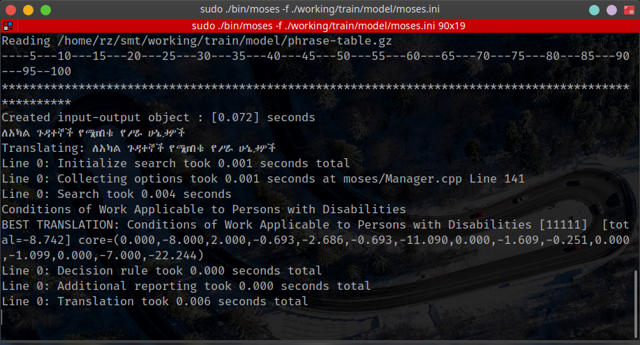

# A Statistical Machine Translator for Amahric and Enlish Language

A statistical machine translator from Amharic to English Language. NLP - CoSc6405

### Steps to compile the tools(Mses,GIZA++,IRSTLM,Boost,CMPH, and XML-RPC)

Visit http://bit.ly/installing-moses-for-smt or

```bash
# run with sudo command or login as root
git clone https://github.com/rabira-hierpa/smt-amharic-to-english.git
cd smt-amharic-to-english
sudo ./build-tools.hs
```

## Steps to Model and train the translation model

See the smt-guide.md file

# Run the translation system

```bash
git clone https://github.com/rabira-hierpa/smt-amharic-to-english.git
cd smt-amharic-to-english
sudo ./build-tools.sh
sudo ./smt-translator.sh
```

# Demo


